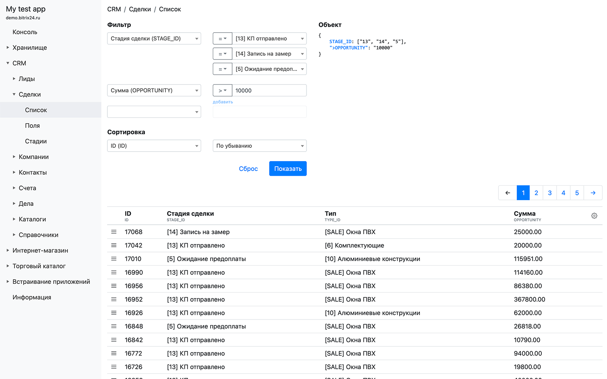
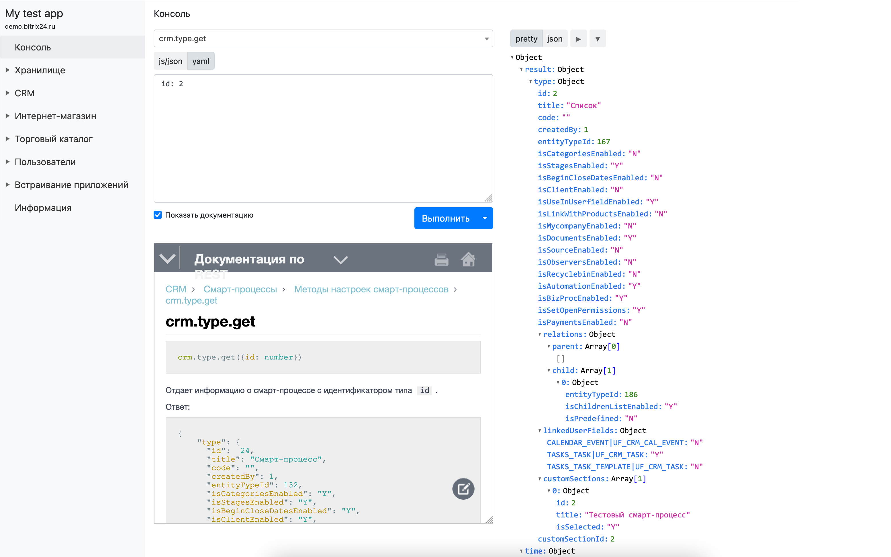

# bx24dev

[Chrome Web Store](https://chrome.google.com/webstore/detail/bx24dev/kfgdjkelnopegmkhnknblmhhomlmofan/related) | [Firefox addon](https://github.com/unnamed777/bx24dev/releases/tag/v0.3.20)

Браузерное расширение для разработчика Bitrix24 REST API. Предоставляет интерфейс для просмотра основных сущностей Битрикс24 
и даёт возможность выполнять произвольные запросы в рамках прав приложения.

|  |
| ------ |

|  |
| ------ |

## Сущности и возможности
* Хранилище
  * Список хранилищ (инфоблоков) с раздельным просмотром данных
  * Элементы - список с фильтрацией
  * Управление свойствами
  * Управление правами на хранилище
* CRM
  * Лиды 
    * Список с фильтрацией
    * Управление пользовательскими полями
    * Статусы
  * Сделки
    * Список с фильтрацией
    * Управление пользовательскими полями
    * Статусы
  * Компании
    * Список с фильтрацией
    * Управление пользовательскими полями
  * Контакты
    * Список с фильтрацией
    * Управление пользовательскими полями
  * Счета
    * Список с фильтрацией
    * Управление пользовательскими полями
    * Статусы
    * Типы плательщиков
  * Дела
    * Список с фильтрацией
    * Типы дел
  * Каталоги
    * Товары - список с фильтрацией
    * Разделы
    * Дерево разделов
  * Справочники
    * Типы
    * Источники
    * Сферы деятельности
* Интернет-магазин
  * Заказы
  * Оплаты
  * Отгрузки
* Пользователи
  * Подразделения
* Встраивание приложений
  * Список встроек
  * Доступные места
* Консоль
  * Выполнение произвольного запроса
  * Документация по методу (с dev.1c-bitrix.ru)
  * Просмотр результата в виде сырого JSON или сворачиваемой структуры
  * Экспорт всех результатов запроса (т.е. >50 записей) в JSON-файл
* Информация
  * Информация о приложении (app.info)
  * Доступные скоупы
  * Доступные методы
  
## Авторизация
Для открытия инструмента достаточно просто нажать кнопку расширения bx24dev в меню/панели браузера. В зависимости от открытой на данный момент страницы
оно либо получит авторизацию самостоятельно, либо откроет окно логина для ввода данных авторизации REST API (tldr: если открыть приложение "Документация по REST API" и нажать кнопку, сработает магия).

Возможны следующие способы авторизации:
* Из открытого приложения Б24. Расширение внедряется в iframe текущего открытого приложения и получает данные авторизации через `BX24.getAuth()`.
* Со страницы редактирования приложения (`devops/edit/application/*`). Расширение берёт из формы путь обработчика, `client_id`, `client_secret`. 
Затем инициирует получение `access_token` согласно описанной процедуре авторзиации OAuth - в новой вкладке открывается страница авторизации Б24, 
запрашиваются права (если требуется), и в момент редиректа сервера авторизации Б24 на страницу обработчика этот запрос перехватывается, 
из него извлекается `code` и получается `access_token`.
* Вебхук. Расширению сообщается URL вебхука или его значимые части (домен, ID пользователя, ключ).
* Токен. Расширению сообщается `access_token`, из-под которого нужно работать.

Вебхук и oauth-авторизацию возможно сохранить для повторных подключений. Для этого надо подключиться к порталу одним из способов, а затем на странице логина (открыть расширение не со страницы Б24 аппа) добавить недавнее подключение в сохранённые. Недавние подключения хранятся до перезапуск браузера, сохранённые - до удаления расширения.

## Права расширения
Для работы расширения нужны некоторые права браузера, о чём сообщается в момент установки. Некоторые из них могут показаться сомнительными, поэтому опишу каждое из них.
* Доступ к вкладкам браузера - требуется для создания вкладки расширения, создания и закрытия вкладок для OAuth авторизации.
* Доступ к вашим данным на всех сайтах   - поскольку приложение Б24 может быть расположено на любом домене, то для внедрения кода получения авторизации из приложения 
требуется доступ к произвольному сайту.
* Доступ к активности браузера во время навигации - требуется для перехвата кода при OAuth авторизации.
* Хранилище - пока не используется, но скоро будет.
